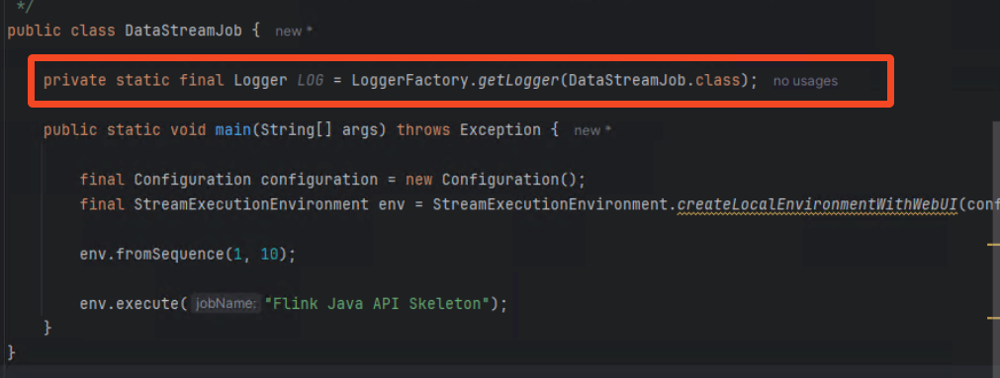

# Build your first Apache Flink Application


In this workshop you will learn to build a Java application using Apache Flink. Some of the concepts we will touch are:

- Development setup
- Overall syntax
- Source and Sink connectors
- Timestamps and watermarks
- Operators (Filter, Window, Map)

## What are you building

So you just order your last Christmas gift for your beloved ones at your favourite e-commerce store (Did I hear Amazon?). But will it arrive on time? Let's find out!

After ordering you realize your product needs to be shipped all the way from Sydney to here (Portorož, Slovenia). Your partner  told you to check the delivery time,
but of course you didn't listen. So now you have to hope everything works out OR you build a real-time data analytics pipeline.


### The real-time analytics application

Luckily our shipment provider publishes all tracking data into an Apache Kafka topic, that we can consume. The data is stored in `JSON` format, as you can see in the following illustration.


Ok, great! Now we know where to get the data for our application.
Let's divide and conquer our situation here into several questions we need to answer:

#### 1. Where is the delivery right now?
#### 2. Will the delivery arrive on time?

# Building the application

Agenda:

- Setup
- Module 1: Flink Skeleton
- Module 2: Making it a good experience
- Module 3: Add Apache Kafka & record de-serialization
- Module 4: Using the OpenSearch Sink
- Module 5: Arrival forecasting


## Prerequisites

Make sure you have the following tools installed on your computer:

- Docker
- Docker Compose
- Git
- Maven
- Java 11
- IntelliJ (VS Code will also work, but instructions focus on IntelliJ as this is the preferred Flink IDE)

1. Open this repo in your IDE (IntelliJ)


You can also run
```shell
git clone https://github.com/flo-mair/flink-getting-started
```

and open it in your IDE.

## Module1: Flink Skeleton

Before you can build the application and the corresponding business logic to find out if your parcel arrives on time,
you need to set up the basic infrastructure and understand how it works.


You can see in the previous picture we will not use all the components yet.

**The goal of this section is to create a Flink Application that reads events from the Apache Kafka cluster**

### Create Apache Flink Application

Go to project settings by clicking on `File` select `Project Structure`.


Make sure `Amazon Correto` in version `11` is selected. If not, download the JDK by clicking `Download JDK`and selecting Amazon Corretto 11.


Confirm with `OK`.

Create a new module in IntelliJ by clicking on the 3 lines, `New` and `New module`.


On the left select `Maven Archetype` and set `flinkJob`as the name.


For JDK select `Amazon Corretto` with version `11`.

For archetype click `Add` and set the following values.


Click `Add` to close the popup.

In the `Advanced Settings` section, set the `ArtificatId` to `flinkJob` and then click Create.


You can also run the following command:

```shell
mvn archetype:generate                               \
      -DarchetypeGroupId=org.apache.flink              \
      -DarchetypeArtifactId=flink-quickstart-java      \
      -DarchetypeVersion=1.18.1
```
After a few seconds the maven project is created. You can close the warning at the bottom.

In the filetree on the left open the `DataStreamJob` class in the editor by double-clicking it.


This is our Apache Flink application. Let`s run it by clicking the green Play button next to the main method.
Then click on `Run 'DataStreamJob.main()'`


In the opened terminal we see a class not found error.


By default, the Apache Flink archetype sets the flink dependency to the scope `provided`.

This is done because usually Flink Jobs are run on a dedicated cluster, where the Flink runtime is already available. Hence, it
does not need to be included in the JAR itself.

We can solve this 2 ways:

- Set all dependencies to scope `compile`
- #### The better one

Open the run configuration for `DataStreamJob`


Click on `Modify options` and select `Add dependencies with "provided" scope to classpath.


This has the benefit that we don't need to change our imports for creating a build that we can deploy on a long-running Flink cluster outside the IDE.


Within the DataStreamJob class create a blank line on line 42 and add the following

```java
env.fromSequence(1, 10).print();
```


You can now run the application again by clicking the green play button on top.


You see the Flink Job gets now executed and exits after a few seconds. If you scroll up a bit you can see the output.

#### Congratulations! You just ran your first Apache Flink application

In the next modules you will keep expanding this class with more logic.

## Module2: Making it a good experience

In the previous module you set up the skeleton of the Flink application. In this module you will run it.

### Update our Flink Application

Open `pom.xml` within the flinkJob directory. Add the following dependency:

```xml
<dependency>
    <groupId>org.apache.flink</groupId>
    <artifactId>flink-runtime-web</artifactId>
    <version>${flink.version}</version>
    <scope>provided</scope>
</dependency>
```

This enables you to see the Flink UI later on. To make this work we also need to make changes to the `DataStreamJob` class.

In line 40 add:

```java
final Configuration configuration = new Configuration();
```

This uses the default Flink configuration, which is fine for now.

In line 41 replace the following line
```java
final StreamExecutionEnvironment env = StreamExecutionEnvironment.getExecutionEnvironment();
```

with this:

```java
final StreamExecutionEnvironment env = StreamExecutionEnvironment.createLocalEnvironmentWithWebUI(configuration)
```

Your complete class should look now like this:

```java
public class DataStreamJob {

	public static void main(String[] args) throws Exception {
		
		final Configuration configuration = new Configuration();
		final StreamExecutionEnvironment env = StreamExecutionEnvironment.createLocalEnvironmentWithWebUI(configuration);

		env.fromSequence(1, 10).print();

		env.execute("Flink Java API Skeleton");
	}
}
```

In the previous module we printed the records but this haven't been really readable. So let's add a logger that helps us in development.
Flink uses the SLF4J logging interface. This allows you to use any logging framework that supports [SLF4J](https://www.slf4j.org/), without having to modify the Flink source code.
By default, [Log4j2](https://logging.apache.org/log4j/2.x/index.html) is used as the underlying logging framework.

Let's add a logger to our DataStreamJob class. As a first step we need to update our dependencies. Open your `pom.xml` file
and change the logging dependencies from scope runtime to `compile`.


Next we need to update our application code. Add this line of code before your main method.

```java
private static final Logger LOG = LoggerFactory.getLogger(DataStreamJob.class);
```

Your code should look now like this.



Alright we now added the logging functionality, but how do we use it? There is no `Stream.log()` function or similar.
If you want to execute a method for each record in a stream you can run the `.map()` operator similar to a list.

Replace the application code with the following snippet.

```java
env
    .fromSequence(1, 10)
    .map(record -> {
    LOG.info(String.valueOf(record));
    return record;
    });
```

Now run the application again via the green play button on top. In the application output you will see, now properly
formatted logs.


Looks good! But wait, why are those records not in order? Let's figure it out!

### Parallelism in Apache Flink

Programs in Flink are inherently parallel and distributed. Streams are split into stream partitions and operators are split into operator subtasks.
The operator subtasks execute independently of each other, in different threads and on different machines or containers.
This means our collection and map function are actually executed in 4 (this is the default) separate threads, which share the work.


Ok then lets set the parallelism to 1 of our Flink application. Parallelism can be set on an operator level (e.g. the map method, or the source)
or on an application level. As you have low throughput in your application lets set `parallelism` to 1 for the whole application.

```java
env.setParallelism(1);
```

Make you set this before your streaming pipeline. Your main method should now look like this:

```java
public static void main(String[] args) throws Exception {

        final Configuration configuration = new Configuration();

        final StreamExecutionEnvironment env = StreamExecutionEnvironment.createLocalEnvironmentWithWebUI(configuration);
        env.setParallelism(1);
        env
                .fromSequence(1, 10)
                .map(record -> {
                    LOG.info(String.valueOf(record));
                    return record;
                });

        env.execute("Flink Java API Skeleton");
    }
```

If you rerun your program you will see now that records are in order.


### Optional: When to use Parallelism?

Parallelism allows your Flink application to scale horizontally. By splitting up one stream of data into several streams that can be processed in
parallel. Most commonly the `.keyBy()` operator is used to partition the stream. Let's say you process e-commerce orders
in your application and want to sum orders by geography. You could key your stream by the value of geography so all US orders are processed by the same subtasks, all EU orders etc.

```json
{
"orderId" : "9898asdf0",
"total" : 199.3,
"geography": "EU"
}
```

This could be done by `stream.keyBy(event::getGeography)`.

If you want to randomly distribute your records (because you use parallelism 8, and have no requirement to partition by a key), you can
use[ `shuffle()`](https://nightlies.apache.org/flink/flink-docs-master/docs/dev/datastream/operators/overview/#random-partitioning).

## Module 3: Add Apache Kafka & record de-serialization

In the previous module you added logging and properly configured your Flink application. You processed a list of numbers.
In this module you will read data from an Apache Kafka cluster.

### What is Apache Kafka?

[Apache Kafka](https://kafka.apache.org/) is a distributed streaming platform that enables the building of real-time data pipelines and streaming applications efficiently. It handles high-throughput, fault-tolerant messaging between applications.

### Why are we using Apache Kafka?

Kafka is a well established data streaming platform, and has lots of connectors, also for Flink. Alternative streaming platforms, that offer a similar
integration with Apache Flink are:

- [Amazon Kinesis](https://aws.amazon.com/kinesis/)
- [Apache Pulsar](https://pulsar.apache.org/)
- [RabbitMQ](https://www.rabbitmq.com/)

*This is not a comprehensive list

You don't need to be a Kafka specialist for this workshop. We will use it as a commodity.

### Create the Apache Kafka source

Apache Flink does not include connectors in the runtime, you need to add each connector via maven. Open `pom.xml` to edit
the dependencies.

Add the following dependencies:

```xml
<dependency>
    <groupId>org.apache.flink</groupId>
    <artifactId>flink-connector-kafka</artifactId>
    <version>3.1.0-1.18</version>
    <scope>compile</scope>
</dependency>
<dependency>
    <groupId>org.apache.flink</groupId>
    <artifactId>flink-connector-base</artifactId>
    <version>${flink.version}</version>
    <scope>compile</scope>
</dependency>
```


Switch to the `DataStreamJob` class and add the following code at the beginning of the main method:

```java
String brokers = "localhost:29092";
```

This will be the endpoint of the Kafka cluster that is used. You will spin up the cluster later on using Docker compose.

Next let's create the Kafka Source / Consumer:

```java
KafkaSource<String> source = KafkaSource.<String>builder()
.setBootstrapServers(brokers)
.setTopics("shipping_updates")
.setGroupId("flinkApplication")
.setStartingOffsets(OffsetsInitializer.earliest())
.setValueOnlyDeserializer(new TrackingRecordDeserializer())
.build();
```


IntelliJ recommends you to import the required classes. Click `Import class` at the missing classes.


As a next step change our streaming pipeline from the sequence of integers to the Kafka source.

```java
DataStream<String> stream = env
.fromSource(source, WatermarkStrategy.noWatermarks(), "Kafka Source");
```

You will learn later on what a WatermarkStrategy is, for now you can use `noWatermarks()`. Add the logging again.

Your main method should now look like this:

```java

public static void main(String[] args) throws Exception {

        String brokers = "localhost:29092";

        KafkaSource<String> source = KafkaSource.<String>builder()
                .setBootstrapServers(brokers)
                .setTopics("shipping_updates")
                .setGroupId("flinkApplication")
                .setStartingOffsets(OffsetsInitializer.earliest())
                .setValueOnlyDeserializer(new SimpleStringSchema())
                .build();

        final Configuration configuration = new Configuration();

        final StreamExecutionEnvironment env = StreamExecutionEnvironment.createLocalEnvironmentWithWebUI(configuration);
        env.setParallelism(1);
        
        DataStream<String> stream = env
                .fromSource(source, WatermarkStrategy.noWatermarks(), "Kafka Source");
        
        stream
                .map(record -> {
                    LOG.info(String.valueOf(record));
                    return record;
                });

        env.execute("Flink Java API Skeleton");
    }
```
Next you start up the Kafka cluster. Run the following steps_


Open the `docker-compose.yml` file in the root directory of the repository.

IntelliJ prompts you to install the docker plugin, click `Install Docker plugin`:


You can now run the services in the  `docker-compose.yml` file , by clicking on the double green arrow.
The other services are needed later on.


You can also run `docker compose up --build` instead.

Now you can start your Flink application again.

You will see the messages in the output.


Let's apply a filter ont he messages, you only care about the delivery with the id `id-0001`.
For this you can use the `filter()` operator in Apache Flink.

When you now try to add the filter() method to stream, you will experience some difficulties. Because the record
is processed as String and not as Object. So you cannot access certain fields. This scenario uses JSON, but also
common formats are Avro or Protobuf. JSON is human-readable and gave you the false impression that records are deserialized
properly.

### Implement a serializer

Serialization is an important topic within Apache Flink, and can have a big impact on your application's performance. However,
this workshop is not meant to be a deep dive for Serialization. You will implement a simple deserializer that deserializes
the JSON string to a POJO.

Create a new Java package called `com.example.serde`.


Create another  package called `com.example.data`.

Within the data package create a new classe called `TrackingRecord`.

Add the following code to the class:

```java


package org.example.data;

import com.fasterxml.jackson.core.JsonProcessingException;
import com.fasterxml.jackson.databind.ObjectMapper;
import lombok.*;

import java.io.Serializable;

@Getter
@Setter
@NoArgsConstructor
@ToString
public class TrackingRecord implements Serializable {
private static final long serialVersionUID = 1L;

    private long timestamp;

    private Coordinates coordinates;
    private String deliveryId;

    @Getter
    @Setter
    @NoArgsConstructor
    @ToString
    public static class Coordinates implements Serializable {
        private static final long serialVersionUID = 1L;

        private float lat;
        private float lon;
    }

}
```

In this class you use Lombok to avoid Getter/Setter boilerplate. You need to add the respective dependency to `pom.xml`:

```xml
<dependency>
    <groupId>org.projectlombok</groupId>
    <artifactId>lombok</artifactId>
    <version>1.18.32</version>
    <scope>provided</scope>
</dependency>
```

To serialize the bytes[] to an object, you need to write a serializer class.

Create a new class `TrackingRecordDeserializer` in `org.example.serde`.
Add the following code to it:

```java

package org.example.serde;

import com.fasterxml.jackson.databind.ObjectMapper;
import org.apache.flink.api.common.serialization.DeserializationSchema;
import org.apache.flink.api.common.typeinfo.TypeInformation;
import org.example.data.TrackingRecord;

import java.io.IOException;

public class TrackingRecordDeserializer implements DeserializationSchema<TrackingRecord> {

    public static final ObjectMapper objectMapper= new ObjectMapper();

    @Override
    public TrackingRecord deserialize(byte[] bytes) throws IOException {
        return objectMapper.readValue(bytes, TrackingRecord.class);
    }

    @Override
    public boolean isEndOfStream(TrackingRecord trackingRecord) {
        return false;
    }

    @Override
    public TypeInformation<TrackingRecord> getProducedType() {
        return TypeInformation.of(TrackingRecord.class);
    }
}
```
#### Can you use Java records?
Java records are supported in the newest Flink versions, but this will come with a performance drawback. As those
have to be serialized by Kyro.

You now change from the `SimpleStringSchema()` to your newly created deserializer.
Your updated Kafka source should look like this:

```java

KafkaSource<TrackingRecord> source = KafkaSource.<TrackingRecord>builder()
.setBootstrapServers(brokers)
.setTopics("shipping_updates")
.setGroupId("flinkApplication")
.setStartingOffsets(OffsetsInitializer.earliest())
.setValueOnlyDeserializer(new TrackingRecordDeserializer())
.build();
```

You also need to update the type of the DataStream.

```java
DataStream<TrackingRecord> stream = env
.fromSource(source, WatermarkStrategy.noWatermarks(), "Kafka Source");
```

and now add the filter function

```java
.filter((FilterFunction<TrackingRecord>) value -> Objects.equals(value.getDeliveryId(), "id-0001"))
```

Your main method should now look like this:

```java

public static void main(String[] args) throws Exception {

        String brokers = "localhost:29092";

        KafkaSource<TrackingRecord> source = KafkaSource.<TrackingRecord>builder()
                .setBootstrapServers(brokers)
                .setTopics("shipping_updates")
                .setGroupId("flinkApplication")
                .setStartingOffsets(OffsetsInitializer.earliest())
                .setValueOnlyDeserializer(new TrackingRecordDeserializer())
                .build();

        final Configuration configuration = new Configuration();

        final StreamExecutionEnvironment env = StreamExecutionEnvironment.createLocalEnvironmentWithWebUI(configuration);
        env.setParallelism(1);

        DataStream<TrackingRecord> stream = env
                .fromSource(source, WatermarkStrategy.noWatermarks(), "Kafka Source");

        stream
                .filter((FilterFunction<TrackingRecord>) value -> Objects.equals(value.getDeliveryId(), "id-0001"))
                .map(record -> {
                    LOG.info(String.valueOf(record));
                    return record;
                });

        env.execute("Flink Java API Skeleton");
    }
```

If you run your application again, you will see that the records are now processed as objects and not JSON strings


## Module 4: Using the OpenSearch Sink


In the previous module you added proper serialization to our pipeline. So now we can start answering our questions that we had in the beginning:

**1. Where is the delivery right now?**
**2. Will the delivery arrive on time?**

## Building a real-time dashboard

To build a real-time dashboard to track our delivery we will use [OpenSearch](https://opensearch.org/) and OpenSearch Dashboards.

As a first step add the OpenSearch dependency to our Flink project.

```xml
<dependencyManagement>
    <dependencies>
        <dependency>
            <groupId>org.apache.httpcomponents</groupId>
            <artifactId>httpclient</artifactId>
            <version>4.5.10</version>
        </dependency>
        <dependency>
            <groupId>org.apache.httpcomponents</groupId>
            <artifactId>httpcore</artifactId>
            <version>4.4.12</version>
        </dependency>
        <dependency>
            <groupId>org.opensearch</groupId>
            <artifactId>opensearch</artifactId>
            <version>2.5.0</version>
        </dependency>
        <dependency>
            <groupId>org.opensearch.client</groupId>
            <artifactId>opensearch-rest-high-level-client</artifactId>
            <version>2.5.0</version>
        </dependency>
    </dependencies>
</dependencyManagement>
<dependency>
    <groupId>org.apache.flink</groupId>
    <artifactId>flink-connector-opensearch</artifactId>
    <version>1.1.0-1.18</version>
</dependency>
```


Next you need up update the streaming pipeline. Create the OpenSearch sink.

```java
String openSearchEndpoint = "https://localhost:9200";

OpensearchSink<String> sink = new OpensearchSinkBuilder<String>()
.setHosts(HttpHost.create(openSearchEndpoint))
.setConnectionUsername("admin")
.setConnectionPassword("P0rt0r0z2024!")
.setBulkFlushInterval(1000)
.setAllowInsecure(true)
.setEmitter(
(element, context, indexer) ->
indexer.add(Requests.indexRequest()
.index("tracking6")
.source(element, XContentType.JSON)))
.build();
```

Next wee need to update the streaming pipeline to use the sink. Your OpenSearch sink expects records in JSON string format.
Hence, you need to add a step to transform your Java object to a String.
Hint: Try to use Jackson, as it is already included with Flink

<details>
    <summary>Solution</summary>
Create an `ObjectMapper` in your main class by adding:

```java
static ObjectMapper objectMapper = new ObjectMapper();
```

Within the main method apply a map function to convert the stream from type `TrackingRecord` to `String`.
```java
inputStream
.map((trackingRecord -> objectMapper.writeValueAsString(trackingRecord)))
.sinkTo(sink);
```
</details>


You can now test your application. Make sure all your docker containers are running. You can check by running

```shell
docker ps
```

You should see several containers running:


Next navigate to [https://localhost:5601]([https://localhost:5601) and log into the dashboard with the following credentials:

user: admin
password: P0rt0r0z2024!

Navigate to `Visualize`

Click on `Create new vizualization` and choose `Maps`.


Click `Add Layer` and choose `Documents`.

For index pattern select `tracking` and set Geospatial field to `coordinates`. Increase the number of documents to 10,000.

Click on `Update`.

Set the time to include the dates from `December 2023` so you can see the records`.

Don`t see any records?
**Make sure your Flink application is running**

### Fantastic! You now can track your package in real-time on this map.

## Module 5: Arrival forecasting

[!WARNING]
> This module uses more advanced Flink operators. This is not meant to be a perfect implementation,
but rather to show you how to use certain Flink operators.

### How can you determine if the parcel is on time?

You need your package at Christmas Eve at 6PM GMT time zone ore more specific:  Sun Dec 24 2023 18:00:00 GMT+0000.
By getting periodic updates from the delivery service you can calculate the speed the package is travelling, and then
forecast if the package will arrive at `Portoroz, Slovenia` on time.

Let's assume our package is always travelling at the same speed for simplicity reasons.

### Calculation

To calculate the speed of the package you need to calculate the distance between at least 2 geo points and divide it by the time
it took to travel this distance.
For this operation you need a stateful operator - which means the operator is doing an operation on a number of records,
and not on every record individually (like the `map()` or `print()` we have used). To achieve such
a behaviour Flink offers windowing operators.

So you will window your stream, calculate the speed of the package and if its fast enough to reach the destination, until Dec 24.
There are lots of ways you can implement this. In this scenario you will use a `Process()` function. The process function
in Flink is a low level function that gives you access to manage state, events and timers yourself. Very often you can achieve
operations by doing aggregate() apply() or reduce() on your stream which is easier to use but not as flexible.

### Implementation

Create a new Java class named `ForecastFunction`.

The class will extend the `ProcessWindowFunction` class.

```java
public class ForecastFunction extends ProcessWindowFunction<TrackingRecord, String, String, TimeWindow>{}
```

The window size will be one hour. So you will use the earliest and latest record (based on Event time) to calculate the
travel speed and if the parcel will arrive on time. As the Flink application could cash in this one hour, you will
use `State`. This allows the application to store its current progress and avoid re-computation in case of failures.

Lets add 2 properties to the class, to store the first and last record

```java
public class ForecastFunction extends ProcessWindowFunction<TrackingRecord, String, String, TimeWindow>{

    private ValueState<TrackingRecord> firstRecord;
    private ValueState<TrackingRecord> lastRecord;

}
```

You can handle different types of state, list lists and maps, but for simplicity you will use 2 valueStates.
Next implement the `open()` method. This runs for each window once at startup.

```java
@Override
public void open(Configuration parameters) {

        ValueStateDescriptor<TrackingRecord> firstRecordDescriptor = new ValueStateDescriptor<>("firstRecord", TrackingRecord.class);
        ValueStateDescriptor<TrackingRecord> lastRecordDescriptor = new ValueStateDescriptor<>("lastRecord", TrackingRecord.class);

        firstRecord = getRuntimeContext().getState(firstRecordDescriptor);
        lastRecord = getRuntimeContext().getState(lastRecordDescriptor);

    }
```

When the window expires (window size + lateness) the state will be automatically removed. If you need additional logic you can
override the `clear()` method.
Let's implement a helper function that calculates the distance between 2 points in km. Create a method `calculateDistance()`

```java
private static double calculateDistance(double lat1, double lon1, double lat2, double lon2) {

        double lat1Rad = Math.toRadians(lat1);
        double lon1Rad = Math.toRadians(lon1);
        double lat2Rad = Math.toRadians(lat2);
        double lon2Rad = Math.toRadians(lon2);

        double deltaLat = lat2Rad - lat1Rad;
        double deltaLon = lon2Rad - lon1Rad;

        double a = Math.pow(Math.sin(deltaLat / 2), 2) +
                Math.cos(lat1Rad) * Math.cos(lat2Rad) *
                        Math.pow(Math.sin(deltaLon / 2), 2);

        double c = 2 * Math.atan2(Math.sqrt(a), Math.sqrt(1 - a));

        return 6371 * c;
    }
```

As a next step you need to implement the logic for processing the records. Override the `process()` method.

```java
@Override
public void process(String s, ProcessWindowFunction<TrackingRecord, String, String, TimeWindow>.Context context, Iterable<TrackingRecord> iterable, Collector<String> collector) throws Exception {}
```


Now let's add the logic. If a record is older than our current `firstRecord` make this one the new firstRecord, the opposite
logic applies to `lastRecord`

```java
for (TrackingRecord record : iterable) {
    if (record.getTimestamp() < firstRecord.value().getTimestamp()) {
        firstRecord.update(record);
}
    if (record.getTimestamp() > lastRecord.value().getTimestamp()) {
        lastRecord.update(record);
    }
}
```

Below the loop, as all the records are processed add some calculations to get some numbers:

```java
double traveledDistance = calculateDistance(firstRecord.value().getCoordinates().getLat(), firstRecord.value().getCoordinates().getLon(), lastRecord.value().getCoordinates().getLat(), lastRecord.value().getCoordinates().getLon());
long traveledTime = lastRecord.value().getTimestamp() - firstRecord.value().getTimestamp();
double speed = traveledDistance / ((double) traveledTime / 3600 / 1000);
double distanceRemaining = calculateDistance(lastRecord.value().getCoordinates().getLat(), lastRecord.value().getCoordinates().getLon(), 45.5167, 13.5667);
long arrivalTimestamp = 1703440800000L;
long timeRemaining = (arrivalTimestamp - lastRecord.value().getTimestamp()) / 3600000;
double possibleDistance = timeRemaining * speed;
```

Now create the output. This will be a simple string with a view values:

```java
String forecast = "";
if (possibleDistance > distanceRemaining) {
    forecast = "on-time";
} else {
    forecast = "delayed";
}

    Instant lastTimestamp = Instant.ofEpochMilli(lastRecord.value().getTimestamp());
    DateTimeFormatter formatter = DateTimeFormatter.ofPattern("yyyy-MM-dd HH:mm:ss").withZone(ZoneOffset.UTC);

    String output = formatter.format(lastTimestamp) +
            " Current forecast: " +
            forecast +
            ". Remaining distance: " +
            Math.floor(distanceRemaining) +
            " Remaining time (h): " +
            timeRemaining +
            " Travelling speed: " +
            Math.floor(speed);

    collector.collect(output);
```

Great! Now you are able to test it. Open the `DataStreamJob` class. Update the pipeline with the following:

```java
inputStream
    .keyBy(TrackingRecord::getDeliveryId)
    .window(TumblingEventTimeWindows.of(Time.minutes(60)))
    .process(new ForecastFunction())
    .map(result -> {
    LOG.info(result);
    return result;
    });
```

Now run the application like you did previously.


You will see now the logs if the package is on time. Depending on how fast you have been with this workshop you will see no updates anymore.

# Congrats! You build your first Apache Flink application

